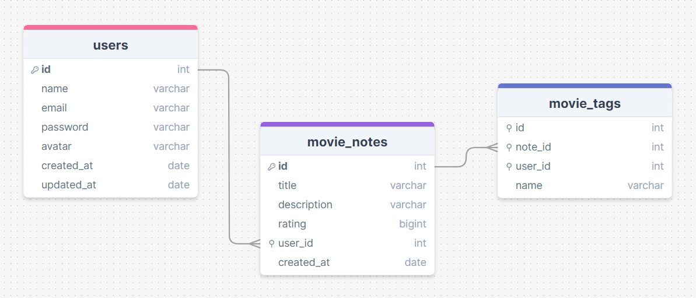

<h1 align="center"> RocketMovies </h1>

> Desafio do Stage 08 - Backend do Explorer da Rocketseat

<p align="center">
  <a href="#project">Projeto</a>&nbsp;&nbsp;&nbsp;|&nbsp;&nbsp;&nbsp;
  <a href="#structure">Estrutura</a>&nbsp;&nbsp;&nbsp;|&nbsp;&nbsp;&nbsp;
  <a href="#technologies">Tecnologias</a>&nbsp;&nbsp;&nbsp;|&nbsp;&nbsp;&nbsp;
  <a href="#extras">Extras</a>&nbsp;&nbsp;&nbsp;|&nbsp;&nbsp;&nbsp;
  <a href="#usage">Utilização</a>
</p>

<p align="center">
  
</p>

<h2 id="project">📂 Projeto</h2>

Aplicação em Node.js para cadastro de filmes com informações como nome, descrição, nota e cria tags relacionadas a ele.

<h2 id="structure">📌 Estrutura</h2>

Abaixo, temos o diagrama utilizado como base para a criação do banco de dados:



<h2 id="technologies">💻 Tecnologias</h2>

Esse projeto foi desenvolvido com as seguintes tecnologias:

- Node.js;
- Express;
- SQLite;
- Knex.js.

<h2 id="extras">🔖 Extras</h2>

Alguns detalhes adicionados ao desafio:

- Criptografia de senhas;
- Validação de e-mail;
- Aplicação do cascade para garantia de um melhor funcionamento do banco de dados.
- Uso do deploy PM2

<h2 id="usage">💡 Utilização</h2>

Para instalar a aplicação em sua máquina localmente siga os seguintes passos:
1 - clone o projeto,
2 - acesse a pasta, 
3 - instale as dependências,
4 - inicie o servidor.

```
$ git clone https://github.com/GuiiDamasceno/rocketMovies-api.git
$ cd rocket-movies-api
$ npm install
$ npm run dev
or
$ npm start (para usar o pm2)
```

## 
  <p align="center">
    Desenvolvido por: Guilherme Damasceno
  </p>
